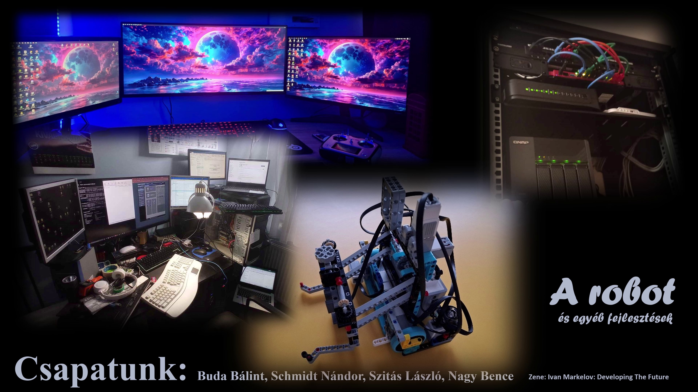
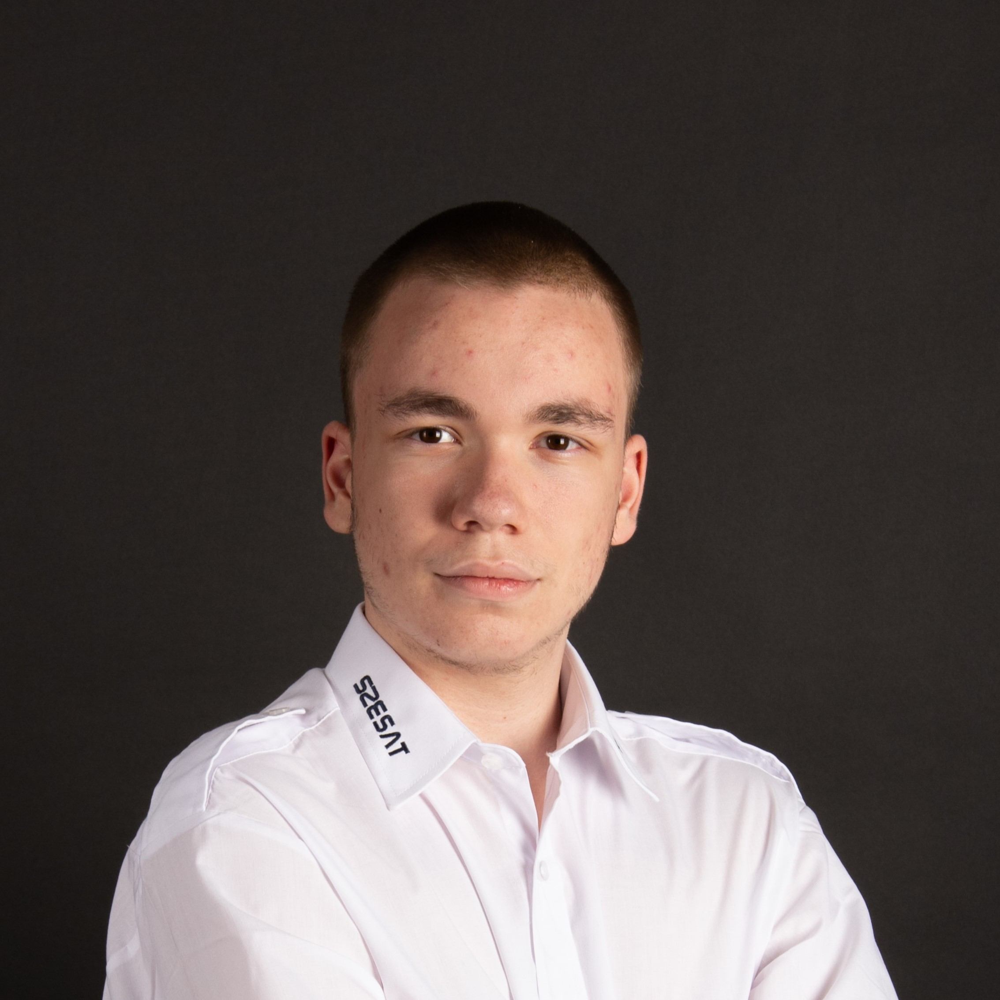
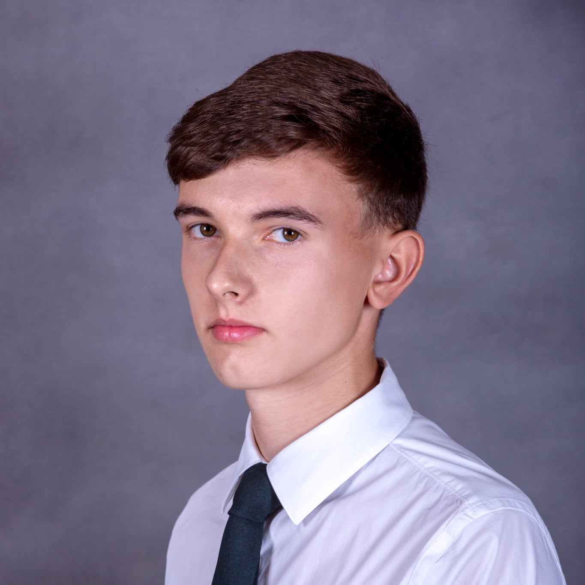
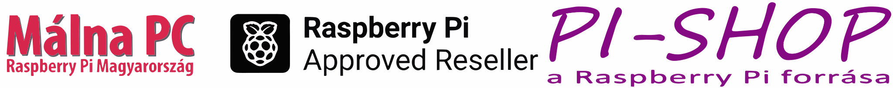
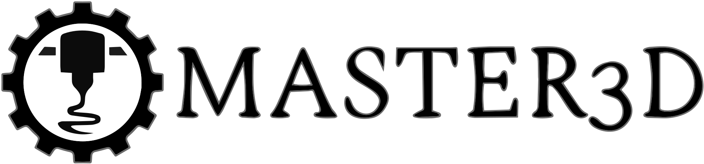

# JedlikBots – Future Robotics Engineers from Győr, Hungary

  

Welcome to the official GitHub page of **JedlikBots**! 🎓🤖 We are the dedicated team of software development and robotics students from the Jedlik Ányos Technical School in Győr, Hungary. Our passion is to combine mechanical engineering, electronics, and software development to create innovative robotics solutions that address real-world problems. Our goal is to apply our acquired knowledge in national and international competitions and to inspire the next generation of engineers.

---

## 🚀 Our Main Project: ProBot X1 – The Next Generation of Competition Robots

The **ProBot X1** is our team's flagship project: a professional, modular robot platform specifically designed for the **WRO (World Robot Olympiad)** international competition series and other high-level technological challenges. During the robot's development, we use state-of-the-art technologies to create a truly competitive and versatile device.

  
   
  <em>The early but functional prototype of the ProBot X1 in its development environment.</em>

---

## 🔧 Technical Deep Dive: The Anatomy of ProBot X1

The ProBot X1 is not just a robot—it's a complex system designed and built with precision engineering. Below, we provide a detailed overview of the project's technical background.

### 1. Mechanical Design and Manufacturing Philosophy

The robot's physical frame and all mechanical components are entirely custom-designed. Our design philosophy centers around **modularity**, **robustness**, and **rapid iteration**.

*   **Design Software:** We create our models in professional CAD software, where every component is designed down to the smallest detail.
*   **Manufacturing Technology:** The parts are produced using 3D printing. This allows us to test new prototypes within days and flexibly adapt the robot's structure to the specific requirements of a given competition task.
*   **Material Selection:** We use PLA for prototypes and PETG or ABS for the final, high-stress components to ensure adequate strength and durability.

| Design in CAD Software (Video) | The Finished, Printed Components |
| :-------------------------------------------------------------------------------------------------------------------------------------------------------------------: | :-----------------------------------------------------------------------------------------------------------------: |
|  |  |

<em>On the left, the design process (click for video!), and on the right, the finished, printed components next to measurement instruments. The lattice structure provides optimal rigidity with minimal weight.</em>

### 2. Advanced Electronics and Custom-Designed PCB

The robot's brain and nervous system are comprised of a custom Printed Circuit Board (PCB) designed by us, located in the `Circuit/kicad/Robot fő nyák_v3/` folder. Our goal was to create a central board that integrates all control and sensor functions, minimizing wiring and maximizing reliability.

**The main functional blocks of the PCB:**

*   **Central Processing Unit (CPU):** The board hosts a **Raspberry Pi Compute Module 5 (CM5)**, which is responsible for computationally intensive tasks like machine vision and artificial intelligence.
*   **Real-Time Microcontroller (MCU):** An **ESP32-S3** microcontroller handles low-level, hardware-related control (motors, sensors), guaranteeing deterministic, real-time operation.
*   **Motor Control Subsystem:**
    *   Four **TMC5160** stepper motor drivers controlled via SPI for precise and silent movement. These drivers have advanced features like `StealthChop2™` for silent operation and `StallGuard2™` for sensorless homing.
    *   Multiple H-bridge outputs for driving DC motors and other actuators.
*   **Power Supply Unit (PSU):** A complex power supply providing multiple voltage levels (5V, 12V) and managing battery charging (`Battery-circuit.kicad_sch`). The system monitors the battery status and provides protection against overcharging and deep discharge.
*   **Sensor Interfaces:**
    *   **I²C Bus:** Multiple I²C devices, including a 9-axis IMU (BNO085) and an environmental sensor (BME280), are connected through an I²C multiplexer, allowing the simultaneous use of devices with the same address.
    *   **Analog-to-Digital Converter (ADC):** A high-resolution ADC (`ADS8688`) is responsible for the precise digitization of analog sensor signals (e.g., distance sensors).
*   **Peripherals:** USB hub, SD card reader, and numerous GPIO pins for modular expandability.

  
   
  <em>The "cable jungle"—an essential part of the prototyping phase, from which the final, clean PCB is born.</em>

### 3. Software Architecture and Intelligent Control

Hardware is only as good as the software that runs on it. The ProBot X1 is built on a sophisticated, two-tier software architecture.

#### High-Level Control (Raspberry Pi - Python)
The Python environment running on the Raspberry Pi is responsible for the robot's "intelligence."

*   **Machine Vision (OpenCV):** Our code in the `Camera/` folder implements a complete image processing pipeline:
    1.  **Image Acquisition:** Reading the frame from the camera.
    2.  **Preprocessing:** Converting the image to the HSV color space, which is more resistant to changes in lighting conditions. Applying Gaussian blur to reduce noise.
    3.  **Color and Shape Recognition:** Identifying relevant objects (e.g., colored blocks, lines) using color masking and contour detection.
    4.  **Data Extraction:** Determining the position, size, and orientation of objects in the camera's view.
*   **Decision-Making and Strategy:** Based on the processed data, the robot builds a state-space representation of its environment and plans its next moves to optimize score.

  
   
  <em>Click the image to watch the video! Based on the camera's image, the LED strip connected to the ESP32 lights up with the corresponding color.</em>

#### Low-Level Control and Firmware (ESP32 - C++)
The C++ firmware running on the ESP32 microcontroller, developed in the `PlatformIO` environment, ensures hard real-time operation.

*   **Responsibilities:** Receiving commands from the Raspberry Pi, precise stepping of motors, continuous collection and transmission of sensor data, and critical fault handling.
*   **Communication Protocol:** A custom, packet-based UART protocol connects the two brains. The protocol, developed in our `robot modells/v1.0/Full_uart_communication_logic_v2/` project, has the structure: `[START_BYTE, COMMAND_ID, PAYLOAD_LENGTH, PAYLOAD..., CHECKSUM]`. This structure guarantees data integrity and robust operation.

---

## 👥 Our Team

Meet the driving force behind JedlikBots, the students who power the project:

| Photo | Name | Role & Expertise |
| :---: | :--- | :--- |
|  | **Bence Nagy** | **Software Developer.** Specializes in sensor data processing, embedded systems programming, and 3D modeling. Bence is responsible for the robot's hardware abstraction layer and the design of its mechanical components. |
|  | **Nándor Schmidt** | **Electronics Designer & Firmware Developer.** The expert on the embedded systems behind the robots' "brains." He designs the PCBs and writes the low-level firmware, ensuring a perfect harmony between hardware and software. |
|  | **Bálint Buda** | **AI & Communications Developer.** Bálint is responsible for implementing machine learning algorithms and for the robot's wired and wireless communication. |

---

## 🏆 Competition Results and Goals

We are proud of our achievements so far and have set even bigger goals for ourselves.

*   **🥈 WRO 2025 Regional Final, Budapest - 2nd Place (May 2025)**
    *   We entered our first WRO competition with a LEGO Mindstorms EV3-based robot and achieved 2nd place in the Budapest regional final. This success qualified us for the national final but also highlighted the limitations of our current technology. With the new, professional ProBot X1, our goal is the World Final!

  
   
  <em>Click the image to watch our LEGO robot's competition run!</em>

---

## ❤️ Support the Engineers of the Future!

Developing the ProBot X1 and participating in international competitions require significant financial and technical resources. Our goal is to perform well at the WRO World Final, which requires building a world-class robot. This is where we need your help!

  
   
  <em>Click the image to see our workshop in action! This is where ideas and robots are born.</em>

### How You Can Help

1.  **With Equipment:** Modern components are essential for our project. Every single piece of donated equipment is a huge help. What we need most:
    *   **Microcontrollers:** Raspberry Pi (any version, including Compute Modules), STM-based boards.
    *   **Motors and Controllers:** Stepper motors, DC motors, servos, motor controllers.
    *   **Sensors:** Precision color and distance sensors, camera modules.
    *   **Materials:** 3D printer filament (PLA, PETG, 1.75 mm), breadboards, cables.
    *   **Measurement Tools:** Logic analyzer for debugging, oscilloscope.

2.  **With Professional Mentorship:** If you are an experienced engineer or developer and would like to share your knowledge, please contact us! A piece of good advice can be invaluable.

3.  **With Financial Support:** Your financial contribution can directly support the purchase of components and our travel to competitions.
### Contact
If you would like to contribute to our success, please write to us!
*   **Email:** nagy.bence1@students.jedlik.eu
*   **Phone:** +36 30 368 8136

---

## 🙏 Our Sponsors

We are deeply grateful to our current sponsors who believe in us and support our work!

  
  

---

## 📂 Repository Contents

This repository documents the entire work of the JedlikBots team. You can find our projects in the following folders:

*   **`/Circuit/`**: Contains the designs for our custom Printed Circuit Boards (PCBs) in KiCad and Altium formats.
*   **`/Robot 3d/`**: 3D models of the robot's mechanical parts (STL, STP files).
*   **`/robot modells/`**: Various software modules and experimental programs that implement the robot's functions (PlatformIO projects).
*   **`/Camera/`**: Python scripts related to machine vision.
*   **`/media/`**: Images and videos of the robot, the team, and the competitions.
*   **`/web/`**: The source code for the team's official website.

**Thank you for your time! Follow our work and cheer for us at the next competition!**
# JedlikBots – A Jövő Robotikai Mérnökei Győrből

  

---
---

Üdvözlünk a **JedlikBots** hivatalos GitHub oldalán! 🎓🤖 Mi vagyunk a Győri Jedlik Ányos Technikum szoftverfejlesztő és robotika iránt elkötelezett diákcsapata. Szenvedélyünk a gépészet, az elektronika és a szoftverfejlesztés ötvözése, amellyel innovatív, valós problémákra választ adó robotikai megoldásokat hozunk létre. Célunk, hogy a megszerzett tudást hazai és nemzetközi versenyeken kamatoztassuk, és inspiráljuk a jövő mérnökgenerációját.

---

## 🚀 Fő Projektünk: ProBot X1 – A Versenyrobot Új Generációja

A **ProBot X1** a csapatunk zászlóshajója: egy professzionális, moduláris robotplatform, amelyet kifejezetten a **WRO (World Robot Olympiad)** nemzetközi versenysorozatra, valamint más magas szintű technológiai kihívásokra terveztünk. A robot fejlesztése során a legmodernebb technológiákat alkalmazzuk, hogy egy valóban versenyképes és sokoldalú eszközt hozzunk létre.

  
   
  <em>A ProBot X1 korai, de működő prototípusa a fejlesztői környezetben.</em>

---

## 🔧 Technikai Mélymerülés: A ProBot X1 Anatómája

A ProBot X1 nem csupán egy robot – egy komplex, precíziós mérnöki munkával megtervezett és épített rendszer. Az alábbiakban részletesen bemutatjuk a projekt műszaki hátterét.

### 1. Mechanikai Tervezés és Gyártásfilozófia

A robot fizikai váza és minden mechanikai eleme teljes mértékben egyedi tervezésű. A tervezési filozófiánk középpontjában a **modularitás**, a **robusztusság** és a **gyors iterálhatóság** áll.

*   **Tervező Szoftver:** A modelleket professzionális CAD szoftverekben készítjük, ahol minden alkatrészt a legapróbb részletekig megtervezünk.
*   **Gyártástechnológia:** Az alkatrészeket 3D nyomtatással állítjuk elő. Ez lehetővé teszi, hogy napok alatt új prototípusokat teszteljünk, és a robotot rugalmasan az adott versenyfeladat specifikus igényeihez igazítsuk.
*   **Anyagválasztás:** A prototípusokhoz PLA-t, a végleges, nagy igénybevételnek kitett alkatrészekhez pedig PETG-t vagy ABS-t használunk a megfelelő szilárdság és tartósság érdekében.

| Tervezés a CAD Szoftverben (Videó) | A Kész, Nyomtatott Alkatrészek |
| :-------------------------------------------------------------------------------------------------------------------------------------------------------------------: | :-----------------------------------------------------------------------------------------------------------------: |
|  |  |

<em>Bal oldalon a tervezési folyamat (kattints a videóért!), jobb oldalon a kész, nyomtatott alkatrészek a mérőműszerek mellett. A rácsszerkezet optimális merevséget biztosít minimális súly mellett.</em>

### 2. Fejlett Elektronika és Egyedi Tervezésű NyÁK

A robot agyát és idegrendszerét egy általunk, a `Circuit/kicad/Robot fő nyák_v3/` mappában tervezett egyedi nyomtatott áramkör (PCB) alkotja. A célunk egy olyan központi panel létrehozása volt, amely integrálja az összes vezérlési és szenzorikai funkciót, minimalizálva a kábelezést és maximalizálva a megbízhatóságot.

**A NyÁK fő funkcionális blokkjai:**

*   **Központi Feldolgozó Egység (CPU):** A panel fogad egy **Raspberry Pi Compute Module 5 (CM5)** kártyát, amely a nagy számítási igényű feladatokért, mint a gépi látás és a mesterséges intelligencia, felel.
*   **Valós Idejű Mikrokontroller (MCU):** Egy **ESP32-S3** mikrokontroller végzi a hardverközeli, alacsony szintű vezérlést (motorok, szenzorok), garantálva a determinisztikus, valós idejű működést.
*   **Motorvezérlő Alrendszer:**
    *   4 darab, SPI-on keresztül vezérelt **TMC5160** léptetőmotor-meghajtó a precíz és csendes mozgásért. Ezen meghajtók olyan fejlett funkciókkal bírnak, mint a `StealthChop2™` a hangtalan működésért és a `StallGuard2™` a szenzor nélküli végállás-érzékelésért.
    *   Több, H-híddal ellátott kimenet DC motorok és egyéb aktuátorok meghajtásához.
*   **Energiaellátás (PSU):** Egy komplex, több feszültségszintet (5V, 12V) biztosító tápegység, amely az akkumulátor töltését is menedzseli (`Battery-circuit.kicad_sch`). A rendszer figyeli az akkumulátor állapotát, és védelmet nyújt a túltöltés és mélykisülés ellen.
*   **Szenzor Interfészek:**
    *   **I²C Busz:** Több I²C eszköz, köztük egy 9 tengelyes IMU (BNO085) és egy környezeti szenzor (BME280) csatlakozik egy I²C multiplexeren keresztül, amely lehetővé teszi az azonos című eszközök egyidejű használatát.
    *   **Analóg-Digitális Konverter (ADC):** Egy nagy felbontású ADC (`ADS8688`) felel az analóg szenzorok (pl. távolságmérők) jeleinek precíz digitalizálásáért.
*   **Perifériák:** USB hub, SD kártya olvasó, és számos GPIO kivezetés a moduláris bővíthetőség érdekében.

  
   
  <em>A "kábel dzsungel" – a prototípus fázis elengedhetetlen része, amelyből a végleges, letisztult PCB megszületik.</em>

### 3. Szoftver Architektúra és Intelligens Vezérlés

A hardver csak annyit ér, amennyit a szoftver kihoz belőle. A ProBot X1 egy kifinomult, kétlépcsős szoftveres architektúrára épül.

#### Magas Szintű Vezérlés (Raspberry Pi - Python)
A Raspberry Pi-on futó Python környezet felel a robot "intelligenciájáért".

*   **Gépi Látás (OpenCV):** A `Camera/` mappában található kódjaink egy komplett képfeldolgozási folyamatot valósítanak meg:
    1.  **Kép Begyűjtése:** A kamera képének beolvasása.
    2.  **Előfeldolgozás:** A kép konvertálása HSV színtérbe, amely jobban ellenáll a fényviszonyok változásainak. Gauss-elmosás alkalmazása a zaj csökkentésére.
    3.  **Szín- és Alakfelismerés:** Színmaszkolással és kontúrkereséssel azonosítjuk a releváns objektumokat (pl. színes kockák, vonalak).
    4.  **Adatkinyerés:** Meghatározzuk az objektumok pozícióját, méretét és orientációját a kamera képén.
*   **Döntéshozatal és Stratégia:** A feldolgozott adatok alapján a robot egy állapottér-reprezentációt épít a környezetéről, és ez alapján tervezi meg a következő lépéseit, optimalizálva a pontszerzést.

  
   
  <em>Kattints a képre a videó megtekintéséhez! A kamera képe alapján az ESP32-re kötött LED-szalag a megfelelő színnel világít.</em>

#### Alacsony Szintű Vezérlés és Firmware (ESP32 - C++)
Az ESP32 mikrokontrolleren futó, `PlatformIO` környezetben fejlesztett C++ firmware biztosítja a kőkemény valós idejű működést.

*   **Feladatai:** Parancsok fogadása a Raspberry Pi-tól, motorok precíz léptetése, szenzoradatok folyamatos gyűjtése és továbbítása, valamint a kritikus hibakezelés.
*   **Kommunikációs Protokoll:** A két agy között egy egyedi, csomagalapú UART protokoll biztosítja a kapcsolatot. A `robot modells/v1.0/Full_uart_communication_logic_v2/` projektünkben kidolgozott protokoll felépítése: `[START_BYTE, PARANCS_ID, ADAT_HOSSZ, ADATOK..., ELLENŐRZŐ_ÖSSZEG]`. Ez a struktúra garantálja az adatok sértetlenségét és a robusztus működést.

---

## 👥 Csapatunk

Ismerd meg a JedlikBots motorjait, a diákokat, akik a projekt mögött állnak:

| Fotó | Név | Szerepkör és szakterület |
| :---: | :--- | :--- |
|  | **Nagy Bence** | **Szoftverfejlesztő.** Specializációja a szenzoradatok feldolgozása, a beágyazott rendszerek programozása és a 3D modellezés. Bence felelős a robot hardverközeli szoftverrétegéért és a mechanikai elemek tervezéséért. |
|  | **Schmidt Nándor** | **Elektronikai Tervező & Firmware Fejlesztő.** A robot "agya" mögött álló beágyazott rendszerek szakértője. Ő tervezi a PCB-ket és írja az alacsony szintű firmware-t, biztosítva a hardver és szoftver tökéletes összhangját. |
|  | **Buda Bálint** | **AI & Kommunikációs Fejlesztő.** Bálint felelős a gépi tanulási algoritmusok implementálásáért és a robotok vezetékes és vezeték nélküli kommunikációjáért. |

---

## 🏆 Versenyeredményeink és Céljaink

Büszkék vagyunk az eddig elért sikereinkre, és még nagyobb célokat tűztünk ki magunk elé.

*   **🥈 WRO 2025 Regionális Döntő, Budapest - 2. helyezés (2025. május)**
    *   Az első WRO versenyünkön egy LEGO Mindstorms EV3 alapú robottal indultunk, és a budapesti regionális döntőben 2. helyezést értünk el. Ez a siker kvalifikált minket a nemzeti döntőbe, de rávilágított a jelenlegi technológiánk korlátaira. Az új, professzionális ProBot X1 robottal a célunk a világdöntő!

  
   
  <em>Kattints a képre a LEGO robotunk versenyfutamának megtekintéséhez!</em>

---

## ❤️ Támogasd a Jövő Mérnökeit!

A ProBot X1 fejlesztése és a nemzetközi versenyeken való részvétel komoly anyagi és technikai erőforrásokat igényel. Célunk a WRO világdöntőn való eredményes szereplés, amihez egy világszínvonalú robot megépítése szükséges. Itt kérjük a te segítségedet!

  
   
  <em>Kattints a képre, és nézd meg a műhelyünket működés közben! Itt születnek az ötletek és a robotok.</em>

### Hogyan Segíthetsz?

1.  **Eszközökkel:** A projektünkhöz elengedhetetlenek a modern alkatrészek. Minden egyes felajánlott eszköz óriási segítséget jelent. Amire a legnagyobb szükségünk van:
    *   **Mikrokontrollerek:** Raspberry Pi (bármely változat, akár Compute Module is), STM-alapú panelek.
    *   **Motorok és vezérlők:** Léptetőmotorok, DC motorok, szervók, motorvezérlők.
    *   **Szenzorok:** Precíziós szín- és távolságérzékelők, kameramodulok.
    *   **Alapanyagok:** 3D nyomtató filament (PLA, PETG, 1.75 mm), próbapanelek, kábelek.
    *   **Mérőműszerek:** Logikai analizátor a hibakereséshez, oszcilloszkóp.

2.  **Szakmai Mentorálással:** Ha tapasztalt mérnök, fejlesztő vagy, és szívesen megosztanád a tudásod, vedd fel velünk a kapcsolatot! Egy-egy jó tanács aranyat érhet.

3.  **Anyagi Támogatással:** Pénzügyi hozzájárulásoddal közvetlenül támogathatod az alkatrészek beszerzését és a versenyekre való utazásunkat.

### Kapcsolat
Ha szeretnél hozzájárulni a sikereinkhez, írj nekünk!
*   **Email:** nagy.bence1@students.jedlik.eu
*   **Telefonszám:** +36 30 368 8136

---

## 🙏 Támogatóink

Hálásan köszönjük eddigi támogatóinknak, akik hisznek bennünk és segítik a munkánkat!

  
  

---

## 📂 A Repository Tartalma

Ez a repository a JedlikBots csapat teljes munkáját dokumentálja. Az alábbi mappákban találod a projektjeinket:

*   **`/Circuit/`**: A robotunkhoz tervezett egyedi nyomtatott áramkörök (PCB) tervei KiCad és Altium formátumban.
*   **`/Robot 3d/`**: A robot mechanikai alkatrészeinek 3D modelljei (STL, STP fájlok).
*   **`/robot modells/`**: Különböző szoftveres modulok és kísérleti programok, amelyek a robot funkcióit valósítják meg (PlatformIO projektek).
*   **`/Camera/`**: A gépi látással kapcsolatos Python scriptek.
*   **`/media/`**: Képek és videók a robotról, a csapatról és a versenyekről.
*   **`/web/`**: A csapat hivatalos weboldalának forráskódja.

**Köszönjük, hogy időt szántál ránk! Kövesd a munkánkat, és szurkolj nekünk a következő versenyen!**
